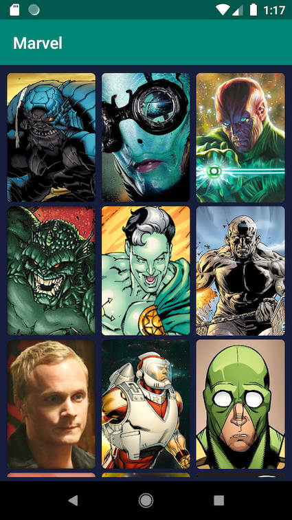
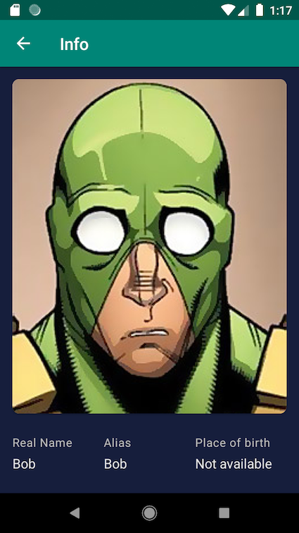
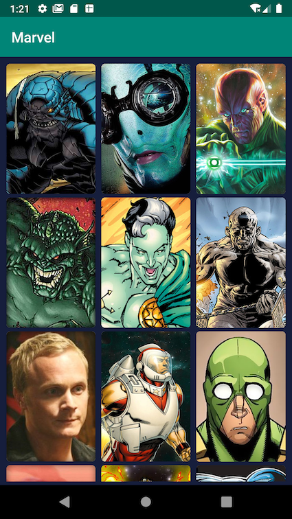
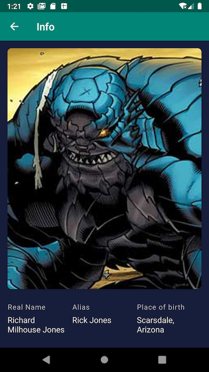

# ViMarvel

## UI

Nexus

Pixel

## Architecture

The app architecture is based on the " [unidirectional data flow](https://proandroiddev.com/unidirectional-data-flow-on-android-the-blog-post-part-1-cadcf88c72f5)" and specifically takes some of the Redux architecture concepts.
It has 2 main parts the UI and the Store, as implies from its name is all of the View side and the store is the app's business logic.
The UI and the Store communicates using Async messages called Actions & Events, Actions are sent by the UI to the Store, Events are sent from the Store to the UI.
On the UI side I've implemented an MVVM approach where we have ViewModels that are managing "Dumb" views (Activities) with bindings and communicate with the Store to get business data
On the Store side the store dispatcher Routes which are the business logic flows, the routes call APIs using the APIClient, in theory the Store keeps a state which holds the business logic model but there was no need for this in the current app.

### *ImageFileDownloader*

This class logic is as following:
- On Init we load the current disc cache into the memory cache
- On get image:
  - If the image exists in the memory cache, return it and finish, else
  -  Get the image from the web, store it in the memory cache, persist the new memory cache in disc and return the new image

A more optimized solution here would be to have a different cache for the disc (with a larges size and its own eviction mechanism)
but I left this implementation as its simpler

We assume each url image is unique and final, meaning the image of a url can't be updated, if we want to set a new image we'll create a new url for that

### *Resizing logic*

In the main screen we set 3 columns for the images and we keep the aspect ratio of each image the same, meaning depending on the length of each image it sets its height, the length of each image depends on the length of the device itself.

for the info screen we set the info text as the footer of the screen and then all the left space (including margins) would be filled by the image, so its ratio will vary in different screen sizes. the image is set to sclae to fill the ImageView and be centered in it.

### *Testing*

I've added 2 types of test (as showcases), unit tests for the routes and an instrumentation test for the main screen

### *Future Improvements*

- Pull to refresh in the main screen
- Handle routes error, displaying errors to users and setting default behaviours
- Set loading animation/image when loading an image into an ImageView
- Default image for when loading fails or no image exists
- Stay in the same main screen scrolling position when returning from an info screen
- Pagination when fetching/loading character list
